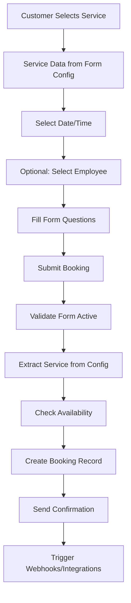

# Booking System Complete Redesign Plan

## Executive Summary

This document outlines a comprehensive redesign of the JoeyJob booking system to address critical architectural issues and create a more maintainable, scalable solution. The core problem is that services are stored as JSON in form configurations but the booking submission expects them in a separate services table, causing validation failures.

## Current System Analysis

### Problems Identified

1. **Service Storage Mismatch**
   - Services are stored in `bookingForms.formConfig` as JSON with temporary node IDs (`node-1757520511784`)
   - Booking submission validates against `services` table which doesn't contain these services
   - No synchronization mechanism between form config services and services table

2. **Data Structure Issues**
   - Complex nested tree structure for services makes querying difficult
   - Form responses stored as unstructured JSON blob
   - No clear separation between configuration and runtime data

3. **Maintenance Challenges**
   - Difficult to update bookings after creation
   - Cannot easily query bookings by service attributes
   - Form changes can break existing booking references

## Proposed Solution

### Core Principles

1. **Denormalization Over Complexity**: Store complete service details in each booking
2. **Snapshot Approach**: Capture all relevant data at booking time
3. **Structured Data**: Use well-defined JSON schemas for form responses
4. **Service Embedding**: Keep services in form config, don't sync to separate table

## Database Schema Design

### Updated `bookings` Table

```sql
CREATE TABLE bookings (
  -- Primary Keys
  id TEXT PRIMARY KEY DEFAULT nanoid(),
  organization_id TEXT NOT NULL REFERENCES organization(id),
  form_id TEXT REFERENCES booking_forms(id),
  
  -- Service Information (Denormalized)
  service_node_id TEXT NOT NULL,        -- Original node ID from form tree
  service_name TEXT NOT NULL,
  service_description TEXT,
  service_duration INTEGER NOT NULL,    -- minutes
  service_price DECIMAL(10,2) NOT NULL,
  service_category TEXT,
  
  -- Customer Information
  customer_name TEXT NOT NULL,
  customer_email TEXT NOT NULL,
  customer_phone TEXT,
  customer_company TEXT,
  
  -- Scheduling
  booking_date DATE NOT NULL,
  start_time TIME NOT NULL,
  end_time TIME NOT NULL,
  timezone TEXT DEFAULT 'UTC',
  
  -- Employee Assignment
  assigned_employee_id TEXT REFERENCES organization_employees(id),
  assigned_employee_name TEXT,          -- Denormalized for display
  assigned_employee_email TEXT,         -- Denormalized for notifications
  
  -- Form Responses (Structured JSON)
  form_responses JSONB NOT NULL,        -- See structure below
  
  -- Status Management
  status TEXT NOT NULL DEFAULT 'pending',
  status_changed_at TIMESTAMP,
  status_changed_by TEXT REFERENCES user(id),
  cancellation_reason TEXT,
  
  -- Notes
  customer_notes TEXT,                  -- From booking form
  internal_notes TEXT,                  -- Staff only
  
  -- Metadata
  confirmation_code TEXT NOT NULL UNIQUE,
  booking_source TEXT DEFAULT 'web',    -- web, admin, api, import
  ip_address TEXT,
  user_agent TEXT,
  
  -- Timestamps
  created_at TIMESTAMP DEFAULT NOW(),
  updated_at TIMESTAMP DEFAULT NOW(),
  
  -- Indexes
  INDEX idx_booking_date (booking_date),
  INDEX idx_customer_email (customer_email),
  INDEX idx_status (status),
  INDEX idx_organization_date (organization_id, booking_date)
);
```

### Form Responses JSON Structure

```typescript
interface FormResponses {
  // Standard fields
  contactInfo: {
    firstName: string;
    lastName: string;
    email: string;
    phone: string;
    company?: string;
  };
  
  address?: {
    street: string;
    city: string;
    state: string;
    zip: string;
    country?: string;
  };
  
  // Custom questions with metadata
  customQuestions: Array<{
    questionId: string;
    questionText: string;
    questionType: 'short-text' | 'long-text' | 'dropdown' | 'multiple-choice' | 'yes-no' | 'date' | 'file-upload';
    answer: string | string[] | boolean | Date;
    fieldName: string;  // For form field mapping
  }>;
  
  // Service-specific questions
  serviceQuestions?: Array<{
    questionId: string;
    questionText: string;
    answer: any;
  }>;
}
```

### Booking Status History Table (Audit Trail)

```sql
CREATE TABLE booking_status_history (
  id TEXT PRIMARY KEY DEFAULT nanoid(),
  booking_id TEXT NOT NULL REFERENCES bookings(id) ON DELETE CASCADE,
  from_status TEXT,
  to_status TEXT NOT NULL,
  changed_by TEXT REFERENCES user(id),
  reason TEXT,
  notes TEXT,
  created_at TIMESTAMP DEFAULT NOW(),
  
  INDEX idx_booking_id (booking_id)
);
```

## Data Flow Architecture

### 1. Booking Creation Flow



### 2. Data Transformation Pipeline

```javascript
// Input from booking form
const bookingInput = {
  formId: "frm_abc123",
  serviceNodeId: "node-1757520511784",
  date: "2025-01-15",
  time: "14:00",
  employee: { id: "emp_xyz", name: "Jane Smith" },
  formData: { /* raw form responses */ }
};

// Transform to booking record
const bookingRecord = {
  // Denormalized service data
  service_node_id: bookingInput.serviceNodeId,
  service_name: extractedService.label,
  service_description: extractedService.description,
  service_duration: extractedService.duration,
  service_price: extractedService.price,
  
  // Structured customer data
  customer_name: `${formData.firstName} ${formData.lastName}`,
  customer_email: formData.email,
  customer_phone: formData.phone,
  
  // Scheduling
  booking_date: bookingInput.date,
  start_time: bookingInput.time,
  end_time: calculateEndTime(bookingInput.time, extractedService.duration),
  
  // Employee
  assigned_employee_id: bookingInput.employee?.id,
  assigned_employee_name: bookingInput.employee?.name,
  
  // Structured form responses
  form_responses: transformFormResponses(formData),
  
  // Metadata
  confirmation_code: generateConfirmationCode(),
  status: 'pending'
};
```

## API Design

### 1. Booking Submission Endpoint

```typescript
POST /api/bookings/submit

Request Body:
{
  organizationId: string;
  formId: string;
  bookingData: {
    service: {
      nodeId: string;
      // Service details extracted from form config
    };
    scheduling: {
      date: string;
      time: string;
    };
    employee?: {
      id: string;
      name: string;
    };
    customer: {
      firstName: string;
      lastName: string;
      email: string;
      phone: string;
      company?: string;
    };
    formResponses: {
      contactInfo: {...};
      address?: {...};
      customQuestions: [...];
    };
  };
}

Response:
{
  success: boolean;
  bookingId: string;
  confirmationCode: string;
  message: string;
}
```

### 2. Booking Management Endpoints

```typescript
// Get bookings with filters
GET /api/bookings
Query params: status, date, customerId, employeeId, search

// Get single booking
GET /api/bookings/:id

// Update booking
PATCH /api/bookings/:id
Body: { status?, assignedEmployeeId?, internalNotes?, ... }

// Cancel booking
POST /api/bookings/:id/cancel
Body: { reason: string }

// Reschedule booking
POST /api/bookings/:id/reschedule
Body: { date: string, time: string }
```

## User Interface Design

### 1. Bookings List View

```typescript
interface BookingListColumn {
  id: 'date' | 'time' | 'customer' | 'service' | 'employee' | 'status' | 'actions';
  label: string;
  sortable: boolean;
  filterable: boolean;
}

const columns: BookingListColumn[] = [
  { id: 'date', label: 'Date', sortable: true, filterable: true },
  { id: 'time', label: 'Time', sortable: true, filterable: false },
  { id: 'customer', label: 'Customer', sortable: true, filterable: true },
  { id: 'service', label: 'Service', sortable: true, filterable: true },
  { id: 'employee', label: 'Assigned To', sortable: true, filterable: true },
  { id: 'status', label: 'Status', sortable: false, filterable: true },
  { id: 'actions', label: 'Actions', sortable: false, filterable: false }
];
```

### 2. Booking Detail View Layout

```
┌─────────────────────────────────────────────────────────┐
│ Booking #JJ12345678                     [Edit] [Cancel] │
├─────────────────────────────────────────────────────────┤
│ ┌─────────────────┐ ┌─────────────────────────────────┐ │
│ │ Service Details │ │ Customer Information          │ │
│ │                 │ │                               │ │
│ │ Name: [...]     │ │ Name: John Doe               │ │
│ │ Duration: 60min │ │ Email: john@example.com      │ │
│ │ Price: $100     │ │ Phone: 555-1234              │ │
│ └─────────────────┘ │ Company: Acme Corp           │ │
│                     └─────────────────────────────────┘ │
│ ┌─────────────────────────────────────────────────────┐ │
│ │ Schedule                                            │ │
│ │ Date: Jan 15, 2025                                 │ │
│ │ Time: 2:00 PM - 3:00 PM                           │ │
│ │ Assigned: Jane Smith                               │ │
│ └─────────────────────────────────────────────────────┘ │
│ ┌─────────────────────────────────────────────────────┐ │
│ │ Form Responses                        [Expand All] │ │
│ │ ▼ Contact Information                              │ │
│ │   • First Name: John                              │ │
│ │   • Last Name: Doe                                │ │
│ │ ▼ Custom Questions                                │ │
│ │   • How did you hear about us?: Google            │ │
│ └─────────────────────────────────────────────────────┘ │
│ ┌─────────────────────────────────────────────────────┐ │
│ │ Internal Notes (Staff Only)                        │ │
│ │ [Text area for notes...]                          │ │
│ └─────────────────────────────────────────────────────┘ │
└─────────────────────────────────────────────────────────┘
```

### 3. Calendar View Features

- **Views**: Month, Week, Day, Agenda
- **Color Coding**: By status (pending=yellow, confirmed=green, cancelled=red)
- **Quick Actions**: Click to view, drag to reschedule
- **Filters**: By service, employee, status
- **Export**: iCal, Google Calendar integration

## Implementation Plan

### Phase 1: Database Foundation (2 days)

**Day 1:**
- [ ] Create new booking schema migration
- [ ] Update TypeScript types and interfaces
- [ ] Create Drizzle schema definitions
- [ ] Write migration script for existing bookings

**Day 2:**
- [ ] Implement booking model with new schema
- [ ] Create booking validation functions
- [ ] Update form response transformers
- [ ] Test database operations

### Phase 2: Booking Submission (2 days)

**Day 3:**
- [ ] Refactor submission endpoint
- [ ] Remove service table dependency
- [ ] Implement service extraction from form config
- [ ] Add availability checking

**Day 4:**
- [ ] Update public booking form
- [ ] Fix data transformation pipeline
- [ ] Add confirmation email system
- [ ] Implement error handling

### Phase 3: Management Interface (3 days)

**Day 5:**
- [ ] Create bookings list component
- [ ] Implement filtering and sorting
- [ ] Add pagination
- [ ] Create booking detail view

**Day 6:**
- [ ] Add booking edit functionality
- [ ] Implement status management
- [ ] Create cancellation flow
- [ ] Add rescheduling feature

**Day 7:**
- [ ] Build calendar view
- [ ] Add drag-and-drop rescheduling
- [ ] Implement bulk actions
- [ ] Create export functionality

### Phase 4: Integration & Polish (2 days)

**Day 8:**
- [ ] Simpro integration updates
- [ ] Webhook system for bookings
- [ ] Email notifications
- [ ] SMS reminders (optional)

**Day 9:**
- [ ] Comprehensive testing
- [ ] Performance optimization
- [ ] Documentation
- [ ] Deploy to staging

### Phase 5: Migration & Launch (1 day)

**Day 10:**
- [ ] Backup existing data
- [ ] Run migration scripts
- [ ] Verify data integrity
- [ ] Deploy to production
- [ ] Monitor for issues

## Testing Strategy

### Unit Tests
- Service extraction from form config
- Form response transformation
- Availability checking logic
- Confirmation code generation

### Integration Tests
- Complete booking flow
- Status updates
- Employee assignment
- Cancellation/rescheduling

### E2E Tests
- Public booking form submission
- Admin booking management
- Calendar interactions
- Email notifications

## Migration Strategy

### For Existing Bookings

```sql
-- Migration script outline
UPDATE bookings SET
  service_node_id = service_id,  -- Temporary mapping
  service_name = (
    SELECT name FROM services WHERE id = bookings.service_id
  ),
  service_duration = (
    SELECT duration FROM services WHERE id = bookings.service_id
  ),
  service_price = price,
  customer_name = customer_name,
  form_responses = jsonb_build_object(
    'contactInfo', jsonb_build_object(
      'email', customer_email,
      'phone', customer_phone
    ),
    'customQuestions', form_data  -- Preserve existing data
  )
WHERE true;
```

### Rollback Plan

1. Keep backup of original bookings table
2. Maintain backward compatibility for 30 days
3. Dual-write to both schemas during transition
4. Monitor for data inconsistencies
5. One-click rollback script ready

## Performance Considerations

### Indexing Strategy
- Index on `booking_date` for calendar queries
- Index on `customer_email` for customer lookup
- Composite index on `(organization_id, booking_date)` for filtered queries
- Full-text search index on customer name

### Caching Strategy
- Cache form configurations (1 hour TTL)
- Cache employee availability (5 minute TTL)
- Cache booking counts for dashboard (1 minute TTL)

### Query Optimization
- Use database views for complex reports
- Implement query result pagination
- Add database connection pooling
- Consider read replicas for reporting

## Security Considerations

### Data Protection
- Encrypt sensitive customer data at rest
- Use parameterized queries to prevent SQL injection
- Implement rate limiting on submission endpoint
- Add CAPTCHA for public booking form

### Access Control
- Row-level security for multi-tenant data
- Role-based permissions for booking management
- Audit trail for all booking modifications
- PII data masking in logs

## Monitoring & Analytics

### Key Metrics
- Booking conversion rate
- Average time to confirmation
- Cancellation rate by service
- Employee utilization rate
- Popular booking times

### Alerts
- Failed booking submissions
- Unusual cancellation patterns
- Double-booking attempts
- System performance degradation

## Future Enhancements

### Phase 2 Features
- Recurring bookings
- Waitlist management
- Package/bundle bookings
- Group bookings
- Customer booking history

### Phase 3 Features
- Advanced analytics dashboard
- Automated scheduling optimization
- Customer preference learning
- Dynamic pricing
- Mobile app integration

## Success Criteria

1. **Immediate Goals**
   - Zero booking submission failures
   - All existing bookings migrated successfully
   - No data loss during migration

2. **Short-term Goals (1 month)**
   - 50% reduction in booking-related support tickets
   - 90% of bookings confirmed within 1 hour
   - Zero double-bookings

3. **Long-term Goals (3 months)**
   - 30% increase in booking completion rate
   - 25% reduction in no-shows
   - 95% customer satisfaction score

## Risk Assessment

### High Risk
- Data loss during migration
- Breaking existing integrations
- Performance degradation with denormalized data

### Medium Risk
- User adoption of new interface
- Edge cases in form response handling
- Time zone handling issues

### Low Risk
- Minor UI inconsistencies
- Email delivery delays
- Browser compatibility issues

## Conclusion

This redesign fundamentally simplifies the booking system architecture while maintaining all necessary functionality. By denormalizing service data and structuring form responses, we create a more maintainable, queryable, and reliable system that can scale with the business needs.

The phased implementation approach minimizes risk while delivering value incrementally. Each phase is independently valuable and can be deployed separately, reducing the impact of any issues that arise.

## Appendices

### A. Database Migration Scripts
[To be added during implementation]

### B. API Documentation
[To be generated from OpenAPI spec]

### C. UI Mockups
[To be created by design team]

### D. Test Cases
[To be documented during QA phase]