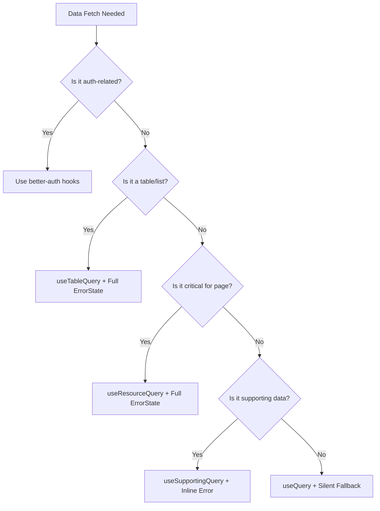

# Error Handling Standards

## Overview

This document defines the standardized error handling patterns for all data fetching and mutations in the application. These standards ensure consistent user experience, maintainable code, and proper integration with better-auth.

## Core Principles

1. **Consistency**: Same error types should be handled the same way across the app
2. **User-Centric**: Error messages should be clear and actionable
3. **Developer-Friendly**: Patterns should be easy to understand and implement
4. **Non-Intrusive**: Error handling should not interfere with better-auth or other libraries

## Error Categories & Display Patterns

### 1. Table/List Data
**When to use**: Any paginated table or list view  
**Display Pattern**: Full page `ErrorState` component  
**Current Examples**: 
- ✅ `src/routes/_authenticated/team.tsx:651`
- ✅ `src/routes/_authenticated/superadmin/users.tsx:411`
- ✅ `src/routes/_authenticated/superadmin/workspaces.tsx:267`
- ✅ `src/features/todos/components/todos-table-page.tsx:587`

**Standard Implementation**:
```tsx
const { data, isError, error, isLoading, refetch } = useTableQuery({
  queryKey: ['resource', 'table', id],
  queryFn: (params) => getResourceTable(params),
  enabled: !!id
})

// Early return for errors
if (isError && error && !isLoading) {
  return <ErrorState error={parseError(error)} onRetry={refetch} />
}
```

### 2. Critical Single Resources
**When to use**: Loading a single item that's essential for the page  
**Display Pattern**: Full page `ErrorState` or redirect  
**Current Examples**:
- ❌ `src/routes/_authenticated/todos.$id.edit.tsx:78-85` (needs migration from try/catch)
- ✅ `src/features/billing/components/billing-page.tsx:152-154`

**Standard Implementation**:
```tsx
const { data: resource, isError, error, isLoading, refetch } = useQuery({
  queryKey: ['resource', id],
  queryFn: () => getResourceById({ data: { id } }),
  retry: 2,
  staleTime: 5 * 60 * 1000,
  enabled: !!id
})

if (isError && error && !isLoading) {
  return <ErrorState error={parseError(error)} onRetry={refetch} />
}
```

**Migration Required**:
```tsx
// BEFORE (todos.$id.edit.tsx:71-91)
useEffect(() => {
  const loadTodo = async () => {
    try {
      const loadedTodo = await getTodoById({ data: { id } })
      setTodo(loadedTodo)
    } catch (error) {
      showError(error)
      navigate({ to: '/' })
    }
  }
  loadTodo()
}, [id])

// AFTER
const { data: todo, isError, error, refetch } = useQuery({
  queryKey: todoKeys.detail(id),
  queryFn: () => getTodoById({ data: { id } }),
  enabled: !!id && !!activeOrganizationId,
  retry: 2
})

if (isError && error) {
  return <ErrorState error={parseError(error)} onRetry={refetch} />
}
```

### 3. Supporting/Secondary Data
**When to use**: Stats, metadata, supplementary information  
**Display Pattern**: Inline error message or silent fallback  
**Current Examples**:
- ❌ `src/routes/_authenticated/superadmin/users.tsx:71-75` (no error handling)
- ❌ `src/routes/_authenticated/superadmin/workspaces.tsx:49-53` (no error handling)

**Standard Implementation**:
```tsx
const { data: stats, isError } = useQuery({
  queryKey: ['stats', organizationId],
  queryFn: () => getStats(),
  retry: 1,
  staleTime: 30 * 1000
})

// In render - graceful degradation
{stats ? (
  <StatsDisplay stats={stats} />
) : isError ? (
  <div className="text-sm text-muted-foreground">
    Unable to load statistics
  </div>
) : (
  <Skeleton className="h-20" />
)}
```

**Migration Required**:
```tsx
// BEFORE (superadmin/users.tsx:71-75)
const { data: stats } = useQuery({
  queryKey: ['admin', 'users', 'stats'],
  queryFn: () => getAdminUserStats(),
  refetchInterval: 30000,
})
// No error handling - stats card just doesn't show

// AFTER
const { data: stats, isError: statsError } = useQuery({
  queryKey: ['admin', 'users', 'stats'],
  queryFn: () => getAdminUserStats(),
  refetchInterval: 30000,
  retry: 1
})

// In the stats card section
{statsError ? (
  <Card>
    <CardContent className="pt-6">
      <p className="text-sm text-muted-foreground">
        Statistics temporarily unavailable
      </p>
    </CardContent>
  </Card>
) : stats && (
  <StatsCards stats={stats} />
)}
```

### 4. Background/Optional Data
**When to use**: Filter options, autocomplete suggestions  
**Display Pattern**: Silent failure with empty defaults  
**Current Examples**:
- `src/components/taali-ui/data-table/data-table-dynamic-faceted-filter.tsx:72-79`

**Standard Implementation**:
```tsx
const { data: options = [], isLoading } = useQuery({
  queryKey: ['filter-options', field],
  queryFn: () => loadFilterOptions(),
  retry: 0,
  staleTime: 10 * 60 * 1000
})

// Always provide fallback, never show error UI
// Empty state is acceptable for filters
```

### 5. Form Mutations
**When to use**: Any create/update/delete operation  
**Display Pattern**: Form field errors + toast notifications  
**Current Examples**:
- ✅ Already standardized in `src/lib/hooks/use-form-mutation.ts`

**Standard Implementation**:
```tsx
const mutation = useFormMutation({
  mutationFn: (data) => createResource(data),
  setError, // from react-hook-form
  onSuccess: (data) => {
    showSuccess('Resource created')
    navigate({ to: `/resource/${data.id}` })
  }
})
```

## Better-Auth Integration Guidelines

### DO NOT Override Better-Auth Hooks

Better-auth provides its own error handling through `@daveyplate/better-auth-tanstack`. Never wrap these hooks:

```tsx
// ❌ WRONG - Don't wrap better-auth hooks
const { data } = useQuery({
  queryKey: ['session'],
  queryFn: () => authClient.getSession()
})

// ✅ CORRECT - Use better-auth hooks directly
const { data: session, error, isPending } = useSession()
```

### Better-Auth Hooks to Leave As-Is

All hooks from `src/lib/auth/auth-hooks.ts`:
- `useSession` - Current user session
- `useListOrganizations` - User's organizations
- `useUpdateUser` - Profile updates
- `useListSessions` - Session management
- `useRevokeSession` - Logout functionality
- All other auth-related hooks

These already have proper error handling and should not be modified.

## Component Standards

### ErrorState Component Enhancement

Location: `src/components/error-state.tsx`

**Current**: Single full-page variant  
**Proposed Enhancement**:
```tsx
interface ErrorStateProps {
  error: ParsedError
  onRetry?: () => void
  variant?: 'full-page' | 'inline' | 'card'
  className?: string
}

export function ErrorState({ 
  error, 
  onRetry, 
  variant = 'full-page',
  className 
}: ErrorStateProps) {
  // Render based on variant
  if (variant === 'inline') {
    return (
      <div className={cn("text-center py-4", className)}>
        <p className="text-sm text-muted-foreground">{message}</p>
        {onRetry && (
          <Button size="sm" variant="ghost" onClick={onRetry}>
            <RefreshCw className="h-3 w-3" />
            Retry
          </Button>
        )}
      </div>
    )
  }
  
  // ... existing full-page implementation
}
```

### Loading States

Maintain consistent loading patterns:
```tsx
// Tables - skeleton rows
{isLoading && <TableSkeleton rows={5} />}

// Single resources - full skeleton
{isLoading && <PageSkeleton />}

// Supporting data - inline skeleton
{isLoading && <Skeleton className="h-20 w-full" />}
```

## Custom Hooks to Create

### 1. useResourceQuery
Location: Create at `src/lib/hooks/use-resource-query.ts`

```tsx
import { useQuery, UseQueryOptions } from '@tanstack/react-query'
import { useNavigate } from '@tanstack/react-router'
import { useErrorHandler } from '@/lib/errors/hooks'

interface UseResourceQueryOptions<TData> {
  queryKey: unknown[]
  queryFn: () => Promise<TData>
  enabled?: boolean
  redirectOnError?: boolean | string
  onError?: (error: unknown) => void
}

export function useResourceQuery<TData>({
  queryKey,
  queryFn,
  enabled = true,
  redirectOnError = false,
  onError
}: UseResourceQueryOptions<TData>) {
  const navigate = useNavigate()
  const { showError } = useErrorHandler()
  
  return useQuery({
    queryKey,
    queryFn,
    enabled,
    retry: 2,
    staleTime: 5 * 60 * 1000,
    onError: (error) => {
      showError(error)
      onError?.(error)
      
      if (redirectOnError) {
        const path = typeof redirectOnError === 'string' 
          ? redirectOnError 
          : '/'
        navigate({ to: path })
      }
    }
  } as UseQueryOptions<TData>)
}
```

### 2. useSupportingQuery
Location: Create at `src/lib/hooks/use-supporting-query.ts`

```tsx
import { useQuery } from '@tanstack/react-query'

interface UseSupportingQueryOptions<TData> {
  queryKey: unknown[]
  queryFn: () => Promise<TData>
  fallback?: TData
  enabled?: boolean
}

export function useSupportingQuery<TData>({
  queryKey,
  queryFn,
  fallback,
  enabled = true
}: UseSupportingQueryOptions<TData>) {
  const query = useQuery({
    queryKey,
    queryFn,
    enabled,
    retry: 1,
    staleTime: 30 * 1000
  })
  
  return {
    ...query,
    data: query.data ?? fallback,
    hasError: query.isError
  }
}
```

## Migration Checklist

### Phase 1: Foundation (Immediate)
- [ ] Create `use-resource-query.ts` hook
- [ ] Create `use-supporting-query.ts` hook  
- [ ] Enhance `ErrorState` component with variants
- [ ] Document patterns in codebase

### Phase 2: Critical Paths (Priority)
- [ ] Migrate `todos.$id.edit.tsx` from useEffect to useQuery
- [ ] Add error handling to admin stats queries
- [ ] Standardize invitation loading (`onboarding.tsx`, `invite.$invitationId.tsx`)

### Phase 3: Supporting Data
- [ ] Add inline errors for stats in `superadmin/users.tsx`
- [ ] Add inline errors for stats in `superadmin/workspaces.tsx`
- [ ] Handle filter loading errors gracefully

### Phase 4: Polish
- [ ] Add proper loading skeletons for all states
- [ ] Implement retry with exponential backoff
- [ ] Add error boundary for unexpected crashes

## Testing Requirements

### Unit Tests
```tsx
describe('Error Handling', () => {
  it('shows ErrorState for table query failures', async () => {
    // Mock API failure
    server.use(
      http.post('/api/todos/table', () => {
        return HttpResponse.error()
      })
    )
    
    render(<TodosTablePage />)
    
    await waitFor(() => {
      expect(screen.getByText(/error/i)).toBeInTheDocument()
      expect(screen.getByRole('button', { name: /retry/i })).toBeInTheDocument()
    })
  })
  
  it('shows inline error for stats failure', async () => {
    // Test supporting data graceful degradation
  })
  
  it('redirects on critical resource failure when configured', async () => {
    // Test redirect behavior
  })
})
```

### E2E Tests
- Test retry functionality works
- Test error recovery flows
- Test form validation errors
- Verify better-auth errors don't interfere

## Monitoring & Observability

### Error Tracking
Add to `src/lib/errors/query-client.ts`:
```tsx
onError: (error) => {
  // Send to error tracking service
  if (process.env.NODE_ENV === 'production') {
    // Sentry, LogRocket, etc.
    trackError(error, {
      category: getErrorCategory(error),
      userId: session?.user?.id
    })
  }
}
```

### Metrics to Track
- Error rate by category
- Retry success rate
- Most common error codes
- User impact (errors per user session)

## Decision Tree



## Examples by File

### Files Needing Updates

1. **`src/routes/_authenticated/todos.$id.edit.tsx`**
   - Lines 71-91: Replace useEffect with useResourceQuery
   - Add proper error boundary

2. **`src/routes/_authenticated/superadmin/users.tsx`**
   - Line 71: Add error handling for stats
   - Display inline error message

3. **`src/routes/_authenticated/superadmin/workspaces.tsx`**
   - Line 49: Add error handling for stats
   - Display inline error message

4. **`src/routes/_authenticated/onboarding.tsx`**
   - Line 22: Migrate to useResourceQuery
   - Add ErrorState component

5. **`src/routes/invite.$invitationId.tsx`**
   - Line 18: Migrate to useResourceQuery
   - Standardize error display

### Files That Are Correct
- ✅ All table pages (todos, team, users, workspaces)
- ✅ Billing page
- ✅ Profile page (uses better-auth correctly)
- ✅ Form mutations (use-form-mutation.ts)

## Troubleshooting Guide

### Common Issues

#### 1. "Cannot read properties of undefined" in ErrorState
**Problem**: Error object is not properly parsed
**Solution**: Always use `parseError()` before passing to ErrorState
```typescript
// ❌ WRONG
<ErrorState error={error} onRetry={refetch} />

// ✅ CORRECT  
<ErrorState error={parseError(error)} onRetry={refetch} />
```

#### 2. Hook dependency warnings in linter
**Problem**: Translation functions in dependency arrays
**Solution**: These are generally safe to ignore for translation hooks, but can be fixed by memoizing

#### 3. useResourceQuery not redirecting on error
**Problem**: redirectOnError not working
**Check**: Ensure you have proper navigation context and the redirect path is valid

#### 4. Stats showing 0 instead of error state
**Problem**: useSupportingQuery providing fallback instead of showing error
**Solution**: Check the `showError` property, not just data truthiness:
```typescript
// ❌ WRONG
{stats ? <StatsDisplay /> : <EmptyState />}

// ✅ CORRECT
{showError ? <ErrorState variant="inline" /> : <StatsDisplay stats={stats} />}
```

#### 5. Better-auth errors not displaying properly
**Problem**: Wrapping better-auth hooks in custom error handling
**Solution**: Use better-auth hooks directly - they have built-in error management

### Testing Error Scenarios

#### Manual Testing
1. **Network Errors**: Disconnect internet, test retry functionality
2. **Permission Errors**: Test with different user roles
3. **Validation Errors**: Submit invalid form data
4. **Server Errors**: Temporarily break server functions
5. **Timeout Errors**: Test with slow network conditions

#### Automated Testing
```typescript
// Mock server errors for testing
import { http, HttpResponse } from 'msw'

test('shows error state when table query fails', async () => {
  server.use(
    http.post('/api/todos/table', () => {
      return HttpResponse.error()
    })
  )
  
  render(<TodosTablePage />)
  
  await waitFor(() => {
    expect(screen.getByText(/error/i)).toBeInTheDocument()
    expect(screen.getByRole('button', { name: /retry/i })).toBeInTheDocument()
  })
})
```

## Migration Examples

### Before/After: Todo Edit Page
```typescript
// BEFORE: useEffect + try/catch pattern
useEffect(() => {
  const loadTodo = async () => {
    try {
      const todo = await getTodoById({ data: { id } })
      setTodo(todo)
    } catch (error) {
      showError(error)
      navigate({ to: '/' })
    }
  }
  loadTodo()
}, [id])

// AFTER: useResourceQuery pattern  
const { data: todo, isError, error, refetch } = useResourceQuery({
  queryKey: todoKeys.detail(id),
  queryFn: () => getTodoById({ data: { id } }),
  enabled: !!id && !!activeOrganizationId,
  redirectOnError: '/'
})

if (isError && error) {
  return <ErrorState error={parseError(error)} onRetry={refetch} />
}
```

### Before/After: Admin Stats
```typescript
// BEFORE: No error handling
const { data: stats } = useQuery({
  queryKey: ['stats'],
  queryFn: getStats,
})

// Stats just don't show if query fails

// AFTER: Graceful degradation
const { data: stats, showError } = useSupportingQuery({
  queryKey: ['stats'],
  queryFn: getStats,
})

{showError ? (
  <ErrorState variant="inline" error={parseError({ message: 'Stats unavailable' })} />
) : (
  <StatsDisplay stats={stats} />
)}
```

## Notes

- Never modify better-auth integration
- Always provide user-friendly error messages  
- Consider network conditions (offline, slow connections)
- Test error scenarios thoroughly
- Document any deviations from these standards
- See comprehensive documentation in `docs/` folder for integration details